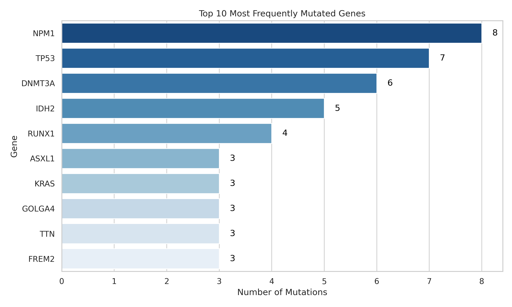
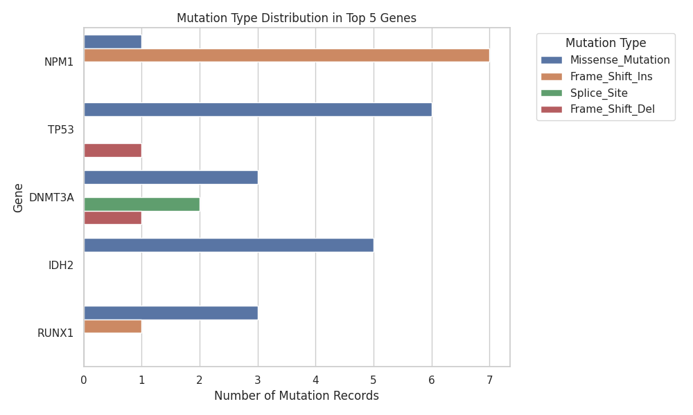

# Mutation-analysis

## Project Overview
 This project analyses somatic data derived from cancer sequencing dataset. The goal is to identify frequently mutated genes, annotate the functional impact of variants, and visualise mutation pythons using python
 The purpose of this project is to:
 * Explore and undertsand real_worl genomic mutation data
 * Implement professional data analysis workflows
 * Build a reprodcible web-based data visualisation app
 
    The project uses mutation data (in TCGA-style Mutation Annotation Format) to explore:
    * Which genes are most frequently mutated
    * What kinds of mutation types occur
    * How data can be cleaned, visualized, and shared

### Project Structure
```graphql
genomic-mutation-project/
│
├── data/
│   ├── raw/                 # Original data_mutations.txt
│   ├── processed/           # Cleaned CSV/JSON for web and analysis
│
├── notebooks/
│   ├── 01_data_exploration.ipynb
│   ├── 02_data_cleaning.ipynb
│   ├── 03_data_analysis.ipynb
│   └── 04_web_app_prototype.ipynb
│
├── docs/
│   ├── data_dictionary.md   # Explains each column
│   └── web_architecture.md  # Design for the web app & cloud setup
│
├── results/
│   ├── top10_mutated_genes.png
│   └── summary_tables/
│
├── api/                     # (Future) API layer for web app
│   └── app.py or index.ts
│
├── frontend/            # (Future) TypeScript or Next.js web
│
└── README.md
```
## Set up and requirements

In requirements.txt
``` txt
pandas
numpy
matplotlib
seaborn
jupyterlab
```
```bash
# 1. Clone the repository
git clone https://github.com/yourusername/genomic-mutation-project.git
cd genomic-mutation-project

# 2. Create virtual environment
python -m venv .venv
source venv/bin/activate  # (or venv\Scripts\activate on Windows)

# 3. Install dependencies
pip install -r requirements.txt

# 4. Launch Jupyter Notebook
jupyter lab
```

## File list
* [Mutation dataset](data/raw/data_mutations.txt)
* [Data-exploration.ipynb](notebooks/data_exploration.ipynb)
* [Dictionary](docs/data_dictionary.md)

## Data Exploration
In this part of the project, I explored the raw dataset ([data_mutations.txt](data/raw/data_mutations.txt)) to understand its structure, content and potential issue as well as to see its story- what questions it naturally raises.

*Benefits of exploring :*
* Identify the most relevant columns
* understand the biological significance of each field.
* Find missing values, duplicates, and patterns
* Determine how dataset should be cleaned.

### Methodology
I load the dataset into Pandas DataFrame and previewed the first few rows.

I inspected, the shape (number of rows and columns), the column names, data types, amount of missing data. 

Commands used for intial exploration:
```py
df.head()
df.info()
df.shape
df.isna().sum()
```
* Understanding the columns
During exploration, I identified several types of column:
- Gene-related columns
    * Hugo_symbol: the gene where the mutation occurs
- Mutation details
    * Variant_Classification: type of mutation (missense, nonsense, frameshift)
    * HGVSp_short: protein-level mutation notation
    * Allele/ Reference_Allele: DNA-level mutation details
- Predictions and annotations columns
    * Polyphem
    * SIFT
    * Impact

I created a data dictionary file, [data_dictionary](docs/data_dictionary.md) to record what the columns mean and note which ones are relevant.

* Missing Data Inspection
 I checked for missing value across the dataset to understand data quality.

Command:
```py
missing_values = df.isna().mean().sort_values(ascending=False)
missing_values.head(20)
```
- Some annotation fields have large portions of missing values
- Core fields like Hugo_Symbol were mostly complete
- Certain prediction scores were missing (expected in real mutation datasets)

This step helped me decide which columns will require cleaning or removal.

* Basic Frequency Exploration
I explored the most frequently mutated genes and the common mutations.

**Command to explore top mutated genes**
```py
df['Hugo_Symbol'].value_counts()
```
This showed that genes like TP53, NPM1, DNMT3A, and KRAS were the most mutated.

**Command to explore common mutation types**
```py
df['Variant_Classification'].value_counts()
```

I found that Missense mutations were the most common type — which aligns with typical cancer mutation datasets.

#### Visualization

I generated visualizations to better understand the distribution of mutations.

**Top 10 Mutated Genes**

A bar chart showing how often each gene appears in the dataset.

**Mutation Type Distribution**

A countplot showing how common each type of mutation is (missense, nonsense, frameshift, etc.).

**Mutation Types Within Top Genes**

A grouped barplot showing:
For the top 5 mutated genes
How many mutations of each type they have
This helped me combine gene-level and mutation-type-level insights

#### Key Observations & Insights

From the exploration, I learned that:

1. `TP53` and `NPM1` are major mutation hotspots. TP53 mutations were mostly missense, which is biologically expected. NPM1 mutations were mostly frameshift, typical in leukemia samples

2. `Missense mutations` dominate the dataset. This means many mutations cause a single amino acid change.

3. The dataset contains real, meaningful biological variation. It follows known patterns found in genomic cancer studies.